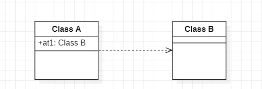
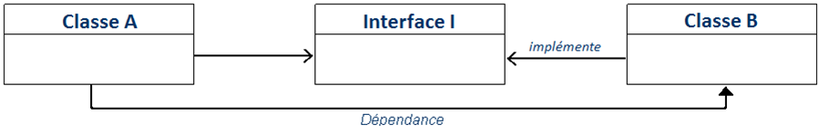
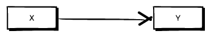
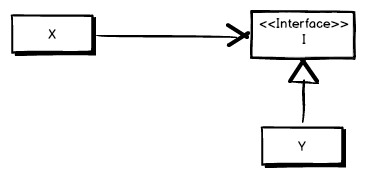

# Wiki Design Pattern : Groupe C
## Objet Composite et Injection de contrôle / de dépendance

Dans ce wiki nous allons vous présenter et expliquer les design patterns suivants : 
* [L'objet Composite](#objetComposite) 
* [L'inversion de contrôle / injection de dépendance](#injection)

Nous allons suivre un plan précis pour chacun d'entre eux afin que ce soit clair, net et pertinent. Nous allons utiliser le plan suivant : 
1. Concept / Définition 
2. Pour quel problème ? ([Composite](#problemeComposite) | [Injection](#problemeInjection))
3. Avantages et Inconvénients ([Composite](#aiComposite) | [Injection](#aiInjection))
4. Exemple ([Composite](#exempleComposite) | [Injection](#exempleInjection))

### Introduction

L’objet Composite et l'injection de dépendances sont les noms de design patterns, ou patrons de conception en français. Les designs patterns sont des solutions aux problèmes récurrents dans la conception d'applications orientées objet. Le patron de conception décrit les grandes lignes d'une solution, qui peuvent ensuite être modifiées et adaptées en fonction des besoins. Il existe au total 23 designs patterns différents, ils sont tous triés dans 4 familles : 
* De **construction** → description de la manière dont un objet peut être créé en isolation du code relatif à la création 
* De **structuration** → description de la manière dont doivent être connectés les objets de l'application afin de rendre ces connexions indépendantes de futures évolutions 
* De **comportement** →  description de comportements d'interaction entre objets
Autres → contient tous les autres design patterns ne faisant pas partie des 3 autres familles 

Ce concept est apparu dans les années 90, suite à la publication d'un ouvrage en 1995 par une équipe composée de **Erich Gamma, Richard Helm, Ralph Johnson et John Vlissides** . Ce livre s’intitule _"Design Patterns : Elements of Reusable Object-Oriented Software"_. Nous pouvons y retrouver les 23 Design Patterns dédiés au développement logiciel évoqués précédemment.

------------------------------------------------------------------------------------------------------------------------------------
### Objet Composite <a id="objetComposite"></a> 

Dans cette partie, nous nous intéresserons uniquement au design Pattern nommé  **“Objet Composite”**, l’idée transmise est de représenter des objets simples ainsi que leurs récipients ou compositions (c’est-à-dire des compositions d’objets) dans une classe abstraite afin de pouvoir les traiter de manière uniforme. En effet , ce design pattern permet de gérer un ensemble d'objets en tant qu'un seul et même objet, en d'autres termes un objet composé de plusieurs autres. Pour illustrer ce concept et faciliter l’explication , nous avons utiliser un diagramme UML ( récupéré sur : https://fr.wikipedia.org/wiki/Composite_(patron_de_conception))  : 
<p align="center">
  
</p>

Nous pouvons donc observer ce diagramme UML représentant l’idée développée par le pattern. 
Le **“Composant”** représente ici une interface qui définit les comportements / opérations commun(e)s de chaque composants (feuille et composite) dans l’arborescence. 

Ensuite nous avons le **“Composite”** (conteneur en francais) , c’est un élément composé de sous-éléments : feuilles ou autres conteneurs. Un conteneur n'a aucune connaissance des classes de ses enfants. Il interagit avec via l'interface du composant. Lorsqu'il reçoit une demande, le conteneur délègue des tâches à ses enfants, traite les résultats intermédiaires et renvoie le résultat final. 

Enfin , nous avons la **“Feuille”**, qui représente les composants n’ayant pas de sous-éléments , elle reprend aussi le comportement par défaut défini dans l'interface.
Nous pouvons affirmer que ce design pattern suit une structure d'arborescence avec une interface , un conteneur et les enfants (pouvant être des conteneurs aussi). 

### Pour quel problème ? <a id="problemeComposite"></a>

Le but principal d’un design pattern est de fournir une solution a un **problème récurrent** lors de la conception et du développement de logiciel, application. Le composite pattern a été mis en place pour résoudre des problèmes sur les applications dont la structure principale peut être représentée sous la forme d’**une arborescence**. 

Le résultat recherché de par l'utilisation de ce pattern est un logiciel le plus flexible possible et caractérisé par des objets faciles à mettre en œuvre, testables, interchangeables et réutilisables. Le pattern composite décrit une façon de traiter de la même manière les objets simples et composites. Il est ainsi possible de créer des structures d'objets faciles à comprendre et permettant l'accès le plus efficace. Cela minimise également la tendance aux erreurs du code.

De ce fait, nous pouvons affirmer que le design pattern composite est très utile et résout de nombreux problèmes rien qu'avec l’utilisation de celui-ci. Mais, nous pouvons imaginer que ce pattern comporte non seulement des avantages mais probablement aussi quelques inconvénients que nous allons pouvoir étudier. 

### Avantages et inconvénients <a id="aiComposite"></a>

Nous allons désormais vous présenter les quelques avantages et inconvénients que rencontre ce design pattern. Les avantages restent plus importants que le nombre d'inconvénients.  Tout d’abord, ce pattern permet de gérer des structures fortement imbriquées. En effet , si la structure suit l’organisation en arborescence alors, qu’il s’agisse d’un objet primitif ou composite, avec des dépendances simples ou complexes : **la profondeur et la largeur de l’imbrication** n’ont pas d’importance pour le modèle de conception composite. 

Ensuite, les différences entre **les types d'objets** peuvent être complètement ignorées par les clients, de sorte qu'aucune fonction n'est nécessaire pour l'accès. L'avantage est que le code client reste simple et léger. 

Enfin, le dernier point fort de ce pattern est que la structure est **flexible** et l’**agrandissement** de celle-ci est très simple. En effet, l’ajout de nouvelles “feuilles” ou de nouveaux objets est très simple et ne nécessite pas forcément de modification du code. 

Malgré ses avantages , nous pouvons citer deux inconvénients au pattern  : 

* La **mise en place de l’interface** est plutôt compliquée : il faut décider quelles opérations doivent être définies spécifiquement dans l’interface et lesquelles dans les classes composites.
* Les **ajustements ultérieurs** des propriétés du composite (par exemple, la restriction des éléments enfants autorisés) s'avèrent également délicats. 

Globalement, ce design pattern reste très utile et pratique , offrant plus d’avantages que d'inconvénients. 

### Exemple <a id="exempleComposite"></a>

Pour commencer, on crée l'interface qui sera implémentée par toutes les classes. Comme nous l'avons dis plus haut, Le **“Composant”** représente ici une interface qui définit les comportements / opérations commun(e)s de chaque composants (feuille et composite) dans l’arborescence. 
```java
public interface Forme {
    public void dessiner(String couleur);
}
```
Deuxièmement, on crée les différentes classes. Ces dernières réprésentes les feuilles implémentant la méthode permettant d'afficher la couleur de la forme choisie. 
```java
public class Carre implements Forme{

    @Override
    public void dessiner(String couleur) {

        System.out.println("Dessin du carre de la couleur " + couleur);
    }
}

public class Cercle implements Forme{

    @Override
    public void dessiner(String couleur) {
        System.out.println("Dessin du cercle de la couleur " + couleur);
    }
}
```
Pour finir, on s'interesse à la classe composite. C'est cette dernière qui représente la hiérarchie. Elle comprend les feuilles précédemment implémentées : le carré et le cercle. On y ajoute aussi les méthodes d'ajout et de supression d'éléments. 
```java
public class Dessin implements Forme{

    private List<Forme> formes = new ArrayList<Forme>();

    @Override
    public void dessiner(String couleur) {
        for(Forme f : formes){
            f.dessiner(couleur);
        }
    }

    public void ajouter(Forme f){
        this.formes.add(f);
    }

    public void retirer(Forme f){
        this.formes.remove(f);
        System.out.println("On a retirer une forme du dessin");
    }
}
```
Voici un exemple d'utilisation de ce Composite. 
```java
public class  Main {
    public static void main(String[] args) {
        Forme carre= new Carre();
        Forme cercle= new Cercle();

        Dessin dessin = new Dessin();
        dessin.ajouter(carre);
        dessin.ajouter(cercle);

        dessin.dessiner("violet");

        dessin.retirer(carre);
    }
}
```
On obtient dans la console :
```
Dessin du carre de la couleur violet
Dessin du cercle de la couleur violet
On a retirer une forme du dessin
```

------------------------------------------------------------------------------------------------------------------------------------


### Injection de contrôle / de dépendance  <a id="injection"></a> 
Intéressons-nous à présent à l' **"Inversion de contrôle / Injection de dépendances"**.
Avant de définir ce qu'est l'injection de dépendances il faut définir ce qu'est le principe d'inversion de contrôle.

**Inversion de contrôle:**

En temps normal, le comportement du framework (l’infrastructure logicielle) est dicté par le logiciel. L’inversion de contrôle est un patron d’architecture (ou “architectural pattern”) qui permute la relation entre le framework et le flot d’exécution du logiciel.

L'infrastructure logicielle prend donc en compte l’exécution du programme et coordonne son fonctionnement. Le logiciel, lui, va définir par la suite ses blocs de codes en fonction de l'interface de programmation qui lui est fournie.

L’inversion de contrôle n’est pas un design pattern en soi, mais plutôt un principe de développement qui peut être implémenté différemment en fonction de la situation

**L'injection de dépendances**

L'objectif premier de ce Design Pattern est d'éviter une dépendance directe entre deux classes et de definir dynamiquement la dépendance plutot que statiquement. Afin d'illustrer ce concept nous pencher sur ces deux diagrammes : (Récupérés sur  : http://igm.univ-mlv.fr/~dr/XPOSE2010/guicespring/di_presentation.html)

<p align="center">
  
</p>

Ce premier diagramme illustre une dépendance classique sans l'utilisation de l'injection de dépendances. Une classe A dépend d'un autre classe B car elle a un attribut de type B. Cette technique est rapide a développer mais elle est statique.

Si on souhaite enlever une classe et la remplcer par une autre (façon dynamique), il faut utiliser l'injection de dépendances.

L'injection de dépendances peut être effectué de plusieurs façons (interface, constructeur, ...)
Nous allons ici regarder comment cela fonctionne avec une interface : 
<p align="center">
  
</p>
Ce deuxième diagramme UML montre l'injection de dépendance avec une interface. Nous expliquerons cette méthode plus en détail dans la partie ([Exemple](#exempleInjection)).


### Pour quel problème ? <a id="problemeInjection"></a>

Soient deux classes **X** et **Y**. Dans notre cas, la classe X se sert de la classe Y pour accomplir quelque chose. Une implémentation classique de cette situation peut être modélisée ainsi : 
<p align="center">
  
</p>
Mais la classe X a-t-elle réellement besoin de savoir qu’elle se sert de la classe Y? 
Il est en effet suffisant que la classe X sache qu’elle utilise un objet qui a le comportement, les méthodes, propriétés de la classe Y sans pourtant savoir d’où elles proviennent.

C’est là que l’injection de dépendances intervient. Ce design pattern extrait une définition abstraite de la classe Y dont va se servir la classe X qui va pouvoir s'exécuter normalement, sans réellement disposer des caractéristiques de Y.
<p align="center">
  
</p>


### Exemple <a id="exempleInjection"></a>

Nous allons ici regarder comment l'injection de dépendances fonctionne avec une interface : 
<p align="center">
  
</p>
Comme montré precedemment, ce diagramme UML montre l'injection de dépendance avec une interface. Cette méthode s'effectue en plusieurs étapes  : 

* Créer une **Interface I** qui déclare toutes les méthodes de la classe B que A utilise
* Déclarer la classe B comme une implémentation de **I**
* Dans la classe A, remplacer toutes les références a la classe B par des références a **I**

Les interfaces en java permettent de définir des méthodes et leurs paramètres sans en définir le code. Ces interfaces sont ensuites implémentées par les classes dont on dépend.

Dans le code on peut mettre en place cette methode : 

Tout d'abord on crée donc l'interface (ici : interfaceI)

```java
public interface interfaceI {
    public void write(string Message);
}
```
Notre Classe B doit donc implémenter I :
```java
public class ClassB implements interfaceI {
    private 
    @Override
    public void write(string Message) {
        System.out.println(Message);
    }
}
```
Enfin, on fait référence à l'interface et non a la classe B.
```java
public class ClassA {
   public static void main(String[] args) {
      interfaceI B = new ClassB();
      B.write("test");
   }
}
```


